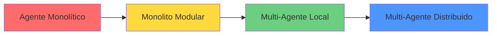

# Guía de Refactorización: De Agente Monolítico a Arquitectura Multi-Agente

**Basado en documentación oficial de Microsoft**

---

## 📋 Tabla de Contenidos

1. [Por Qué Refactorizar](#por-qué-refactorizar)
2. [Estrategia de Refactorización](#estrategia-de-refactorización)
3. [Paso a Paso con Código](#paso-a-paso-con-código)
4. [Patrones de Orquestación](#patrones-de-orquestación)
5. [Arquitectura de Referencia](#arquitectura-de-referencia)
6. [Implementación Práctica](#implementación-práctica)
7. [Recursos Oficiales](#recursos-oficiales)

---

## 🚨 Por Qué Refactorizar

### Problemas del Agente Monolítico

Según Microsoft, los agentes monolíticos presentan estos problemas críticos:

> **"A single 'do-everything' agent... monolithic agents resist modularity, stalling innovation. Enterprises found themselves constrained, not by the capabilities of AI itself, but by the rigidity of the systems they've wrapped around it."**
>
> — [Microsoft: Designing Multi-Agent Intelligence](https://devblogs.microsoft.com/blog/designing-multi-agent-intelligence)

**Síntomas de un agente monolítico:**

- ❌ Un solo agente con muchas herramientas y responsabilidades
- ❌ Prompts extensos que intentan manejar todos los casos de uso
- ❌ Difícil de probar, mantener y escalar
- ❌ Cambios en una funcionalidad afectan todo el sistema
- ❌ No puede especializarse en dominios específicos
- ❌ Difícil agregar nuevos modelos o herramientas

### Ventajas de Multi-Agente

Microsoft identifica ventajas clave de los sistemas multi-agente: especialización (los agentes individuales pueden centrarse en un dominio o funcionalidad específicos), escalabilidad (los agentes se pueden agregar o modificar sin rediseñar todo el sistema), mantenibilidad (las pruebas y la depuración se pueden centrar en agentes individuales) y optimización (cada agente puede usar modelos distintos, enfoques y herramientas).

---

## 📐 Estrategia de Refactorización

### Enfoque Recomendado: Modular Monolith → Microservicios

Microsoft recomienda que muchos sistemas exitosos "comienzan como monolitos modulares y evolucionan extrayendo gradualmente agentes u orquestadores en servicios a medida que la escala, el tamaño del equipo o los requisitos comerciales cambian. Este enfoque por etapas ayuda a evitar costosas sobre-ingenierías tempranas".

### Fases de Migración



---

## 🛠️ Paso a Paso con Código

### Fase 1: Identificar Responsabilidades

**Antes: Agente Monolítico**

```python
# ❌ ANTES: Un solo agente hace todo
class MonolithicAgent:
    def __init__(self):
        self.llm = ChatOpenAI(model="gpt-4")
        self.tools = [
            self.enrich_context,
            self.generate_sql,
            self.execute_query,
            self.transform_response,
            self.validate_permissions,
            self.apply_synonyms,
            self.log_query
        ]
        self.prompt = """
        Eres un asistente que:
        1. Enriquece consultas con contexto
        2. Genera SQL cuando sea necesario
        3. Ejecuta queries en Fabric
        4. Valida permisos de usuario
        5. Transforma respuestas a lenguaje natural
        6. Aplica diccionario de sinónimos
        ... (prompt de 500+ líneas)
        """
    
    def process(self, user_query, user_context):
        # Un solo método hace todo
        # Difícil de probar y mantener
        response = self.llm.invoke(
            self.prompt + user_query,
            tools=self.tools
        )
        return response
```

### Fase 2: Extraer Agentes Especializados

**Después: Agentes Separados**

```python
# ✅ DESPUÉS: Agentes especializados con responsabilidades únicas

# 1. Agente de Enriquecimiento de Contexto
class ContextEnrichmentAgent:
    """
    Responsabilidad única: Enriquecer consultas con contexto relevante
    """
    def __init__(self):
        self.llm = ChatOpenAI(model="gpt-4")
        self.prompt_template = self._load_prompt("context_enrichment")
        self.synonyms_dict = self._load_synonyms()
    
    async def enrich(self, query: str, user_context: dict) -> str:
        """Enriquece la consulta aplicando sinónimos y contexto"""
        # Aplicar sinónimos
        enriched = self._apply_synonyms(query)
        
        # Agregar contexto del usuario
        prompt = self.prompt_template.format(
            query=enriched,
            user_role=user_context.get('role'),
            user_department=user_context.get('department')
        )
        
        result = await self.llm.ainvoke(prompt)
        return result.content
    
    def _apply_synonyms(self, query: str) -> str:
        """Aplica diccionario de sinónimos"""
        for canonical, synonyms in self.synonyms_dict.items():
            for synonym in synonyms:
                query = query.replace(synonym, canonical)
        return query
    
    def _load_prompt(self, name: str) -> str:
        """Carga prompt desde base de datos"""
        # Implementación de carga desde DB
        pass

# 2. Agente Generador de SQL
class SQLGeneratorAgent:
    """
    Responsabilidad única: Generar SQL válido y seguro
    """
    def __init__(self, fabric_client):
        self.llm = ChatOpenAI(model="gpt-4")
        self.fabric = fabric_client
        self.prompt_template = self._load_prompt("sql_generation")
    
    async def generate_sql(
        self, 
        enriched_query: str, 
        user_context: dict
    ) -> Optional[str]:
        """
        Determina si necesita SQL y lo genera
        
        Returns:
            SQL query string si es necesario, None si no requiere DB
        """
        # 1. Decidir si necesita SQL
        needs_sql = await self._requires_database(enriched_query)
        
        if not needs_sql:
            return None
        
        # 2. Obtener tablas permitidas según rol
        allowed_tables = self._get_allowed_tables(user_context['roles'])
        
        # 3. Obtener esquema filtrado
        schema = self._get_schema(allowed_tables)
        
        # 4. Generar SQL
        prompt = self.prompt_template.format(
            query=enriched_query,
            schema=schema,
            allowed_tables=', '.join(allowed_tables)
        )
        
        result = await self.llm.ainvoke(prompt)
        sql = self._extract_sql(result.content)
        
        # 5. Validar SQL
        if not self._validate_sql(sql, allowed_tables):
            raise SecurityError("SQL accede a tablas no permitidas")
        
        return sql
    
    def _get_allowed_tables(self, roles: list) -> list:
        """Retorna tablas según roles del usuario"""
        table_map = {
            'call_center': ['clientes', 'tickets'],
            'sucursal': ['clientes', 'tickets', 'ventas_sucursal'],
            'direccion': ['*']  # Acceso completo
        }
        
        allowed = set()
        for role in roles:
            allowed.update(table_map.get(role, []))
        
        return list(allowed)

# 3. Agente Ejecutor
class QueryExecutorAgent:
    """
    Responsabilidad única: Ejecutar queries en Fabric de forma segura
    """
    def __init__(self, fabric_client):
        self.fabric = fabric_client
        self.cache = QueryCache()
    
    @retry(
        stop=stop_after_attempt(3),
        wait=wait_exponential(multiplier=1, min=2, max=10)
    )
    async def execute(
        self, 
        sql: str, 
        user_context: dict,
        timeout: int = 30
    ) -> dict:
        """
        Ejecuta SQL en Fabric con reintentos y cache
        """
        # 1. Verificar cache
        cache_key = self._get_cache_key(sql, user_context)
        cached = await self.cache.get(cache_key)
        
        if cached:
            return cached
        
        # 2. Ejecutar con timeout
        try:
            result = await asyncio.wait_for(
                self.fabric.execute(sql),
                timeout=timeout
            )
        except asyncio.TimeoutError:
            # Degradación elegante
            return {
                'status': 'timeout',
                'message': 'Consulta tomó demasiado tiempo',
                'fallback': await self._get_fallback_data(sql)
            }
        
        # 3. Guardar en cache
        await self.cache.set(cache_key, result, ttl=300)
        
        return result

# 4. Agente Transformador
class ResponseTransformerAgent:
    """
    Responsabilidad única: Transformar resultados a lenguaje natural
    """
    def __init__(self):
        self.llm = ChatOpenAI(model="gpt-4o-mini")  # Modelo más económico
        self.prompt_template = self._load_prompt("response_transformation")
    
    async def transform(
        self, 
        raw_results: dict, 
        original_query: str,
        user_context: dict
    ) -> str:
        """
        Transforma resultados técnicos en respuesta natural
        """
        # Formatear resultados para el prompt
        formatted_results = self._format_results(raw_results)
        
        prompt = self.prompt_template.format(
            original_query=original_query,
            results=formatted_results,
            user_name=user_context.get('name', 'Usuario')
        )
        
        result = await self.llm.ainvoke(prompt)
        return result.content
    
    def _format_results(self, results: dict) -> str:
        """Formatea resultados para el LLM"""
        if isinstance(results, dict) and 'rows' in results:
            # Convertir a tabla markdown
            return self._to_markdown_table(results['rows'])
        return str(results)
```

### Fase 3: Implementar Orquestador

```python
# ✅ Orquestador que coordina agentes especializados

from typing import Optional
import asyncio

class AgentOrchestrator:
    """
    Orquestador secuencial para consultas inteligentes
    
    Documentación oficial:
    https://learn.microsoft.com/en-us/azure/architecture/ai-ml/guide/ai-agent-design-patterns
    """
    
    def __init__(
        self,
        context_agent: ContextEnrichmentAgent,
        sql_agent: SQLGeneratorAgent,
        executor_agent: QueryExecutorAgent,
        transformer_agent: ResponseTransformerAgent
    ):
        self.context_agent = context_agent
        self.sql_agent = sql_agent
        self.executor_agent = executor_agent
        self.transformer_agent = transformer_agent
        
        # Observabilidad
        self.tracer = trace.get_tracer(__name__)
    
    @tracer.start_as_current_span("orchestrator.process")
    async def process(
        self, 
        user_query: str, 
        user_context: dict
    ) -> dict:
        """
        Procesa consulta a través de pipeline de agentes especializados
        
        Patrón: Orquestación Secuencial
        https://learn.microsoft.com/en-us/azure/architecture/ai-ml/guide/ai-agent-design-patterns#sequential-orchestration
        
        Args:
            user_query: Consulta del usuario
            user_context: Contexto (roles, permisos, etc.)
        
        Returns:
            Respuesta procesada con metadatos
        """
        span = trace.get_current_span()
        span.set_attribute("user.role", user_context.get('role'))
        span.set_attribute("query.original", user_query)
        
        try:
            # FASE 1: Enriquecimiento de contexto
            with self.tracer.start_as_current_span("agent.context_enrichment"):
                enriched_query = await self.context_agent.enrich(
                    user_query,
                    user_context
                )
                span.set_attribute("query.enriched", enriched_query)
            
            # FASE 2: Generación de SQL (si aplica)
            with self.tracer.start_as_current_span("agent.sql_generation"):
                sql = await self.sql_agent.generate_sql(
                    enriched_query,
                    user_context
                )
                
                if sql:
                    span.set_attribute("sql.generated", True)
                    span.set_attribute("sql.query", sql)
                else:
                    # Handoff: No requiere SQL
                    span.set_attribute("sql.generated", False)
                    return await self._handle_non_sql_query(
                        enriched_query,
                        user_context
                    )
            
            # FASE 3: Ejecución
            with self.tracer.start_as_current_span("agent.query_execution"):
                raw_results = await self.executor_agent.execute(
                    sql,
                    user_context
                )
                span.set_attribute("results.row_count", 
                                 len(raw_results.get('rows', [])))
            
            # FASE 4: Transformación
            with self.tracer.start_as_current_span("agent.response_transformation"):
                final_response = await self.transformer_agent.transform(
                    raw_results,
                    user_query,
                    user_context
                )
            
            return {
                'response': final_response,
                'metadata': {
                    'sql_generated': sql,
                    'row_count': len(raw_results.get('rows', [])),
                    'agents_used': [
                        'context_enrichment',
                        'sql_generation',
                        'query_execution',
                        'response_transformation'
                    ]
                }
            }
            
        except Exception as e:
            span.set_attribute("error", True)
            span.set_attribute("error.message", str(e))
            raise
    
    async def _handle_non_sql_query(
        self,
        enriched_query: str,
        user_context: dict
    ) -> dict:
        """
        Handoff a agente conversacional para consultas no-SQL
        
        Patrón: Orquestación de Entrega (Handoff)
        https://learn.microsoft.com/en-us/azure/architecture/ai-ml/guide/ai-agent-design-patterns#handoff-orchestration
        """
        # Delegar a un agente conversacional diferente
        conversational_agent = ConversationalAgent()
        response = await conversational_agent.respond(
            enriched_query,
            user_context
        )
        
        return {
            'response': response,
            'metadata': {
                'sql_generated': None,
                'agents_used': ['context_enrichment', 'conversational']
            }
        }
```

### Fase 4: Configuración Modular

```python
# ✅ Configuración centralizada

# config/agents_config.py
from dataclasses import dataclass
from typing import Dict, List

@dataclass
class AgentConfig:
    """Configuración de un agente"""
    name: str
    model: str
    prompt_version: str
    timeout: int = 30
    max_retries: int = 3

@dataclass
class SystemConfig:
    """Configuración del sistema multi-agente"""
    agents: Dict[str, AgentConfig]
    security: dict
    observability: dict

# Configuración cargada desde archivo o Azure App Configuration
MULTI_AGENT_CONFIG = SystemConfig(
    agents={
        'context_enrichment': AgentConfig(
            name='context_enrichment',
            model='gpt-4',
            prompt_version='v2.1',
            timeout=10
        ),
        'sql_generation': AgentConfig(
            name='sql_generation',
            model='gpt-4',
            prompt_version='v1.5',
            timeout=15
        ),
        'query_execution': AgentConfig(
            name='query_execution',
            model=None,  # No usa LLM
            prompt_version=None,
            timeout=30,
            max_retries=3
        ),
        'response_transformation': AgentConfig(
            name='response_transformation',
            model='gpt-4o-mini',  # Modelo económico
            prompt_version='v1.0',
            timeout=10
        )
    },
    security={
        'key_vault_url': 'https://your-keyvault.vault.azure.net/',
        'identity_provider': 'entra_id'
    },
    observability={
        'app_insights_key': 'your-key',
        'trace_all_agents': True,
        'log_prompts': False  # PII concerns
    }
)
```

---

## 🎯 Patrones de Orquestación

### 1. Orquestación Secuencial (Tu Caso de Uso)

```python
# Flujo: Agente 1 → Agente 2 → Agente 3 → Agente 4
# Cada agente procesa la salida del anterior

async def sequential_orchestration(query, context):
    # Paso 1
    enriched = await context_agent.enrich(query, context)
    
    # Paso 2 (depende de paso 1)
    sql = await sql_agent.generate_sql(enriched, context)
    
    # Paso 3 (depende de paso 2)
    results = await executor.execute(sql, context)
    
    # Paso 4 (depende de paso 3)
    response = await transformer.transform(results, query, context)
    
    return response
```

**Cuándo usar:** 
- ✅ Cada fase depende de la anterior
- ✅ Flujo predecible y lineal
- ✅ Tu caso: pregunta → contexto → SQL → ejecución → respuesta

**Documentación oficial:**
- [Sequential Orchestration Pattern](https://learn.microsoft.com/en-us/azure/architecture/ai-ml/guide/ai-agent-design-patterns#sequential-orchestration)

### 2. Orquestación de Entrega (Handoff)

```python
# Para ruteo dinámico basado en contenido

async def handoff_orchestration(query, context):
    enriched = await context_agent.enrich(query, context)
    
    # Decisión dinámica de ruteo
    if requires_sql(enriched):
        return await sql_pipeline(enriched, context)
    elif requires_analysis(enriched):
        return await analysis_agent(enriched, context)
    elif requires_calculation(enriched):
        return await math_agent(enriched, context)
    else:
        return await conversational_agent(enriched, context)
```

**Cuándo usar:**
- ✅ El agente óptimo no se conoce de antemano
- ✅ Diferentes tipos de consultas requieren diferentes pipelines
- ✅ Tu caso: Consultas SQL vs consultas conversacionales

**Documentación oficial:**
- [Handoff Orchestration Pattern](https://learn.microsoft.com/en-us/azure/architecture/ai-ml/guide/ai-agent-design-patterns#handoff-orchestration)

### 3. Orquestación Simultánea

```python
# Para tareas paralelas independientes

async def concurrent_orchestration(query, context):
    # Ejecutar múltiples agentes en paralelo
    results = await asyncio.gather(
        fundamental_analysis_agent.analyze(query),
        technical_analysis_agent.analyze(query),
        sentiment_analysis_agent.analyze(query)
    )
    
    # Agregar resultados
    return aggregator.combine(results)
```

**Cuándo usar:**
- ✅ Tareas independientes que se pueden paralelizar
- ✅ Reducir latencia total
- ❌ No aplicable directamente a tu caso de SQL secuencial

**Documentación oficial:**
- [Concurrent Orchestration Pattern](https://learn.microsoft.com/en-us/azure/architecture/ai-ml/guide/ai-agent-design-patterns#concurrent-orchestration)

---

## 🏗️ Arquitectura de Referencia

### Diagrama de Componentes

```
┌─────────────────────────────────────────────────────────┐
│                    User Application                      │
└──────────────────────┬──────────────────────────────────┘
                       │
                       ▼
┌─────────────────────────────────────────────────────────┐
│                   Orchestrator Agent                     │
│  • Coordina flujo entre agentes                         │
│  • Maneja contexto de usuario                           │
│  • Implementa observabilidad                            │
└──┬─────────────┬─────────────┬─────────────┬───────────┘
   │             │             │             │
   ▼             ▼             ▼             ▼
┌──────────┐ ┌──────────┐ ┌──────────┐ ┌──────────┐
│Context   │ │   SQL    │ │ Executor │ │Transform │
│Enrichment│→│Generator │→│  Agent   │→│  Agent   │
└──────────┘ └──────────┘ └──────────┘ └──────────┘
     │            │             │             │
     ▼            ▼             ▼             ▼
┌──────────┐ ┌──────────┐ ┌──────────┐ ┌──────────┐
│ Synonyms │ │  Schema  │ │  Fabric  │ │   LLM    │
│   Dict   │ │Knowledge │ │  Client  │ │  Model   │
└──────────┘ └──────────┘ └──────────┘ └──────────┘
     │            │             │             │
     ▼            ▼             ▼             ▼
┌─────────────────────────────────────────────────────┐
│              Shared Infrastructure                   │
│  • Azure Key Vault (Credenciales)                   │
│  • Azure Entra ID (Identidad)                       │
│  • Azure Monitor (Observabilidad)                   │
│  • Prompt Database (Gestión de Prompts)            │
└─────────────────────────────────────────────────────┘
```

### Registro de Agentes (Agent Registry)

Microsoft enfatiza que "el objetivo principal de un registro de agentes es proporcionar un repositorio de información para que los agentes en el sistema sepan cómo comunicarse entre sí. En la mayoría de los casos, en una arquitectura multi-agente basada en orquestador, el registro permite al agente orquestador consultar qué agentes son mejores para llevar a cabo las tareas inmediatas".

```python
# agent_registry.py

class AgentRegistry:
    """
    Registro centralizado de agentes disponibles
    
    Documentación:
    https://microsoft.github.io/multi-agent-reference-architecture/docs/agent-registry/Agent-Registry.html
    """
    
    def __init__(self):
        self.agents = {}
    
    def register(
        self,
        agent_id: str,
        agent_metadata: dict
    ):
        """
        Registra un agente en el sistema
        
        Args:
            agent_id: Identificador único del agente
            agent_metadata: Información del agente (capacidades, modelos, etc.)
        """
        self.agents[agent_id] = {
            'id': agent_id,
            'name': agent_metadata['name'],
            'capabilities': agent_metadata['capabilities'],
            'model': agent_metadata.get('model'),
            'version': agent_metadata.get('version'),
            'status': 'active',
            'registered_at': datetime.utcnow()
        }
    
    def get_agent(self, agent_id: str) -> dict:
        """Obtiene información de un agente"""
        return self.agents.get(agent_id)
    
    def find_agents_by_capability(
        self,
        capability: str
    ) -> List[dict]:
        """Encuentra agentes con una capacidad específica"""
        return [
            agent for agent in self.agents.values()
            if capability in agent['capabilities']
        ]

# Uso
registry = AgentRegistry()

# Registrar agentes
registry.register('context_enrichment', {
    'name': 'Context Enrichment Agent',
    'capabilities': ['context_enrichment', 'synonym_mapping'],
    'model': 'gpt-4',
    'version': 'v2.1'
})

registry.register('sql_generation', {
    'name': 'SQL Generator Agent',
    'capabilities': ['sql_generation', 'schema_validation'],
    'model': 'gpt-4',
    'version': 'v1.5'
})

# Buscar agentes
sql_agents = registry.find_agents_by_capability('sql_generation')
```

---

## 💻 Implementación Práctica

### Ejemplo Completo de Uso

```python
# main.py

import asyncio
from typing import Dict
from azure.identity import DefaultAzureCredential
from azure.keyvault.secrets import SecretClient

async def main():
    """
    Ejemplo completo de sistema multi-agente
    """
    
    # 1. Configurar credenciales desde Key Vault
    credential = DefaultAzureCredential()
    key_vault_url = "https://your-vault.vault.azure.net/"
    secret_client = SecretClient(
        vault_url=key_vault_url,
        credential=credential
    )
    
    # 2. Inicializar agentes
    context_agent = ContextEnrichmentAgent()
    sql_agent = SQLGeneratorAgent(fabric_client=fabric)
    executor_agent = QueryExecutorAgent(fabric_client=fabric)
    transformer_agent = ResponseTransformerAgent()
    
    # 3. Crear orquestador
    orchestrator = AgentOrchestrator(
        context_agent=context_agent,
        sql_agent=sql_agent,
        executor_agent=executor_agent,
        transformer_agent=transformer_agent
    )
    
    # 4. Procesar consulta
    user_query = "¿Cuáles fueron las ventas del mes pasado?"
    user_context = {
        'user_id': 'user123',
        'name': 'Juan Pérez',
        'role': 'sucursal',
        'roles': ['sucursal'],
        'department': 'Ventas',
        'branch_id': 'SUC-001'
    }
    
    # 5. Ejecutar
    result = await orchestrator.process(user_query, user_context)
    
    print("Respuesta:", result['response'])
    print("Metadatos:", result['metadata'])

if __name__ == "__main__":
    asyncio.run(main())
```

### Pruebas Unitarias

```python
# tests/test_agents.py

import pytest
from unittest.mock import Mock, patch

class TestContextEnrichmentAgent:
    """
    Tests para agente de enriquecimiento
    
    Ventaja de separación: Cada agente se puede probar independientemente
    """
    
    @pytest.fixture
    def agent(self):
        return ContextEnrichmentAgent()
    
    @pytest.mark.asyncio
    async def test_apply_synonyms(self, agent):
        """Prueba aplicación de sinónimos"""
        query = "¿Cuál es el revenue del Q1?"
        result = agent._apply_synonyms(query)
        
        assert "ventas" in result.lower()
        assert "trimestre" in result.lower()
    
    @pytest.mark.asyncio
    async def test_enrich_with_user_context(self, agent):
        """Prueba enriquecimiento con contexto de usuario"""
        query = "ventas del mes"
        context = {
            'role': 'sucursal',
            'branch_id': 'SUC-001'
        }
        
        result = await agent.enrich(query, context)
        
        assert 'SUC-001' in result or 'sucursal' in result.lower()

class TestSQLGeneratorAgent:
    """Tests para generador de SQL"""
    
    @pytest.fixture
    def agent(self):
        fabric_mock = Mock()
        return SQLGeneratorAgent(fabric_mock)
    
    @pytest.mark.asyncio
    async def test_security_filtering(self, agent):
        """Prueba que filtra tablas según permisos"""
        context = {'roles': ['call_center']}
        allowed = agent._get_allowed_tables(context['roles'])
        
        # Call center no debe tener acceso a tablas financieras
        assert 'finanzas' not in allowed
        assert 'nomina' not in allowed
    
    @pytest.mark.asyncio
    async def test_sql_validation(self, agent):
        """Prueba validación de SQL generado"""
        sql = "SELECT * FROM finanzas"
        allowed_tables = ['clientes', 'tickets']
        
        # Debe detectar acceso a tabla no permitida
        is_valid = agent._validate_sql(sql, allowed_tables)
        assert not is_valid
```

---

## 📚 Recursos Oficiales de Microsoft

### Documentación Principal

1. **[Multi-Agent Reference Architecture](https://microsoft.github.io/multi-agent-reference-architecture/)**
   - Guía conceptual completa para sistemas multi-agente
   - Basada en implementaciones reales con clientes de Microsoft
   - 🔗 https://microsoft.github.io/multi-agent-reference-architecture/

2. **[AI Agent Design Patterns - Azure Architecture Center](https://learn.microsoft.com/en-us/azure/architecture/ai-ml/guide/ai-agent-design-patterns)**
   - Patrones fundamentales de orquestación
   - Secuencial, Simultáneo, Chat Grupal, Entrega (Handoff), Magnético
   - 🔗 https://learn.microsoft.com/en-us/azure/architecture/ai-ml/guide/ai-agent-design-patterns

3. **[Designing Multi-Agent Intelligence - Microsoft Dev Blog](https://devblogs.microsoft.com/blog/designing-multi-agent-intelligence)**
   - Por qué migrar de monolito a multi-agente
   - Casos de uso y ejemplos reales
   - 🔗 https://devblogs.microsoft.com/blog/designing-multi-agent-intelligence

### Frameworks de Implementación

4. **[Microsoft Agent Framework](https://learn.microsoft.com/en-us/agent-framework/overview/agent-framework-overview)**
   - Framework oficial para construir agentes
   - Soporte nativo para patrones de orquestación
   - 🔗 https://learn.microsoft.com/en-us/agent-framework/overview/agent-framework-overview

5. **[Semantic Kernel - Agent Orchestration](https://learn.microsoft.com/en-us/semantic-kernel/frameworks/agent/agent-orchestration/)**
   - SDK para orquestación de agentes en .NET y Python
   - Implementaciones específicas de patrones
   - 🔗 https://learn.microsoft.com/en-us/semantic-kernel/frameworks/agent/agent-orchestration/

### Componentes de Arquitectura

6. **[Agent Registry Documentation](https://microsoft.github.io/multi-agent-reference-architecture/docs/agent-registry/Agent-Registry.html)**
   - Registro centralizado de agentes
   - Discovery y comunicación entre agentes
   - 🔗 https://microsoft.github.io/multi-agent-reference-architecture/docs/agent-registry/Agent-Registry.html

7. **[Monolith vs Microservices for Agents](https://microsoft.github.io/multi-agent-reference-architecture/docs/design-options/Microservices.html)**
   - Cuándo usar monolito modular vs servicios distribuidos
   - Estrategia de migración gradual
   - 🔗 https://microsoft.github.io/multi-agent-reference-architecture/docs/design-options/Microservices.html

### Ejemplos de Código

8. **[Agent Framework Workflow Samples (GitHub)](https://github.com/microsoft/agent-framework/tree/main/workflow-samples)**
   - Ejemplos prácticos de workflows declarativos
   - Implementaciones de patrones de orquestación
   - 🔗 https://github.com/microsoft/agent-framework/tree/main/workflow-samples

9. **[Semantic Kernel Multi-Agent Samples (GitHub)](https://github.com/microsoft/semantic-kernel/tree/main/python/samples/getting_started_with_agents)**
   - Ejemplos en Python de orquestación multi-agente
   - Casos de uso reales
   - 🔗 https://github.com/microsoft/semantic-kernel/tree/main/python/samples/getting_started_with_agents

### Seguridad

10. **[Azure AI Foundry - Virtual Network for Agents](https://learn.microsoft.com/en-us/azure/ai-foundry/agents/how-to/virtual-network)**
    - Aislamiento de red privada para agentes
    - Identidades administradas y reglas de red
    - 🔗 https://learn.microsoft.com/en-us/azure/ai-foundry/agents/how-to/virtual-network

---

## ✅ Checklist de Refactorización

### Fase de Análisis

- [ ] **Identificar responsabilidades** del agente monolítico
  - [ ] Listar todas las funciones que realiza
  - [ ] Agrupar funciones por dominio/especialización
  - [ ] Identificar dependencias entre funciones

- [ ] **Definir límites de agentes**
  - [ ] Cada agente tiene una responsabilidad única y clara
  - [ ] Los agentes son independientes y testables
  - [ ] Hay interfaces bien definidas entre agentes

### Fase de Diseño

- [ ] **Seleccionar patrón de orquestación**
  - [ ] Secuencial (para flujos dependientes) ✅ Tu caso
  - [ ] Handoff (para ruteo dinámico) ✅ Recomendado adicional
  - [ ] Simultáneo (para tareas paralelas)
  - [ ] Otro patrón según necesidades

- [ ] **Diseñar arquitectura de seguridad**
  - [ ] Azure Key Vault para credenciales
  - [ ] Azure Entra ID para identidad
  - [ ] Control de acceso basado en roles (RBAC)
  - [ ] Filtrado de datos según permisos

- [ ] **Planear gestión de prompts**
  - [ ] Base de datos para prompts
  - [ ] Versionamiento de prompts
  - [ ] Diccionarios de sinónimos externos

### Fase de Implementación

- [ ] **Extraer primer agente especializado**
  - [ ] Comenzar con el más simple (ej: transformador)
  - [ ] Crear tests unitarios
  - [ ] Documentar interfaz

- [ ] **Implementar agentes restantes**
  - [ ] Un agente a la vez
  - [ ] Mantener monolito funcionando en paralelo
  - [ ] Tests de integración después de cada agente

- [ ] **Crear orquestador**
  - [ ] Implementar lógica de coordinación
  - [ ] Agregar observabilidad (tracing)
  - [ ] Manejo de errores y reintentos

- [ ] **Implementar Agent Registry**
  - [ ] Registro de agentes disponibles
  - [ ] Discovery de capacidades
  - [ ] Health checks

### Fase de Observabilidad

- [ ] **Configurar instrumentación**
  - [ ] Azure Monitor / Application Insights
  - [ ] Tracing distribuido (OpenTelemetry)
  - [ ] Métricas por agente
  - [ ] Alertas en errores críticos

- [ ] **Definir métricas clave**
  - [ ] Latencia por agente
  - [ ] Tasa de éxito/error
  - [ ] Uso de recursos (tokens, memoria)
  - [ ] Cache hit rate

### Fase de Producción

- [ ] **Migración gradual**
  - [ ] Feature flags para controlar uso
  - [ ] A/B testing: monolito vs multi-agente
  - [ ] Monitoreo comparativo de rendimiento

- [ ] **Rollback plan**
  - [ ] Capacidad de volver a monolito
  - [ ] Backups de configuraciones
  - [ ] Documentación de procedimientos

---

## 🎓 Recomendaciones Finales

### De Microsoft

> **"Many successful systems begin as modular monoliths and evolve by gradually extracting agents or the orchestrator into services as scale, team size, or business requirements change."**
>
> — [Microsoft Multi-Agent Reference Architecture](https://microsoft.github.io/multi-agent-reference-architecture/docs/design-options/Microservices.html)

### Para Tu Equipo

1. **Comenzar con Monolito Modular**
   - No saltar directo a microservicios distribuidos
   - Mantener agentes como módulos bien definidos
   - Migrar a servicios solo cuando sea necesario

2. **Priorizar Observabilidad**
   - Instrumentar TODOS los agentes desde el día 1
   - Facilita debugging y optimización

3. **Seguridad desde el Diseño**
   - Implementar RBAC en cada agente
   - Nunca pasar credenciales entre agentes
   - Usar Azure Key Vault y Managed Identities

4. **Documentar Decisiones**
   - Por qué se eligió cada patrón
   - Interfaces entre agentes
   - Procedimientos de despliegue

---

## 📖 Glosario

| Término | Definición |
|---------|------------|
| **Agente** | Componente autónomo que usa LLM para realizar tareas específicas |
| **Orquestador** | Componente que coordina el flujo entre múltiples agentes |
| **Monolito** | Sistema con un solo agente que maneja múltiples responsabilidades |
| **Handoff** | Transferencia de control de un agente a otro |
| **Agent Registry** | Repositorio centralizado de información sobre agentes disponibles |
| **Observabilidad** | Capacidad de entender el comportamiento del sistema mediante métricas |

---

**Última actualización:** Octubre 2025  
**Basado en:** Microsoft Multi-Agent Reference Architecture  
**Versión:** 2.0
